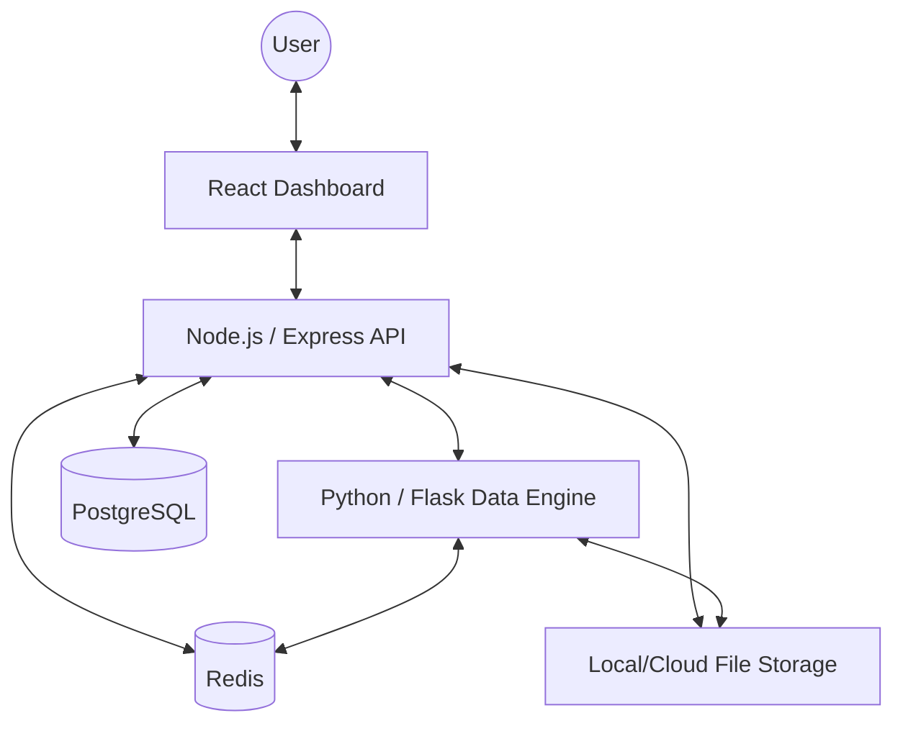

# DataLens Architecture Specification

## 1. System Architecture
DataLens follows a decoupled, polyglot architecture. It separates application orchestration (Node.js) from heavy data computation (Python).

### 1.1 High-Level Component Diagram

## 2. Service Boundaries

### 2.1 Node.js Backend (The Orchestrator)
- **Responsibility**: API Gateway, User Management, Job Scheduling, Result Aggregation, and Metadata Storage.
- **Key Logic**:
  - Managing the lifecycle of datasets and analysis jobs.
  - Interfacing with the database and cache.
  - Triggering analysis in the Python engine.
  - Handling file uploads and storage paths.

### 2.2 Python Data Engine (The Analyst)
- **Responsibility**: Heavy-duty data processing, statistical profiling, and anomaly detection.
- **Key Logic**:
  - Reading datasets from storage.
  - Performing numerical analysis (Pandas/NumPy/Scikit-learn).
  - Calculating quality scores based on deterministic rules.
  - Detecting drift and outliers.
  - Generating raw analysis results.

### 2.3 React Frontend (The Viewer)
- **Responsibility**: Data visualization and user interaction.
- **Key Logic**:
  - Uploading datasets.
  - Polling/Viewing job status.
  - Rendering profiling metrics and anomaly reports.
  - Comparing dataset versions.

## 3. Request and Data Flow

### 3.1 Dataset Upload & Analysis Flow
1. **Upload**: User uploads a file via the React Frontend.
2. **Registration**: Node.js Backend saves the file to storage, creates a `dataset` and `dataset_version` record in PostgreSQL.
3. **Job Creation**: Backend creates an `analysis_job` record with status `PENDING`.
4. **Trigger**: Backend sends a POST request to the Python Engine with the `job_id` and `file_path`.
5. **Processing**: 
   - Python Engine reads the file.
   - Runs profiling $\rightarrow$ quality checks $\rightarrow$ anomaly detection.
   - Calculates a final Quality Score.
6. **Completion**: Python Engine sends the results back to the Backend (or updates a shared state/DB).
7. **Update**: Backend updates the `analysis_job` to `COMPLETED` and saves `analysis_results` to PostgreSQL.
8. **Notification**: Frontend (via polling or websocket) updates the UI to show the results.

## 4. Communication Strategy
- **Backend $\rightarrow$ Engine**: Synchronous REST call to initiate the job. The Engine returns a `202 Accepted` immediately after validating the request, then processes the job asynchronously.
- **Engine $\rightarrow$ Backend**: REST call to a dedicated "callback" endpoint in the Backend to report job completion and submit results.
- **State Tracking**: Redis is used to track the real-time status of active jobs to avoid heavy DB polling for the frontend.

## 5. Deployment Architecture
- **Containerization**: Each service (Frontend, Backend, Engine, DB, Redis) runs in a separate Docker container.
- **Orchestration**: Docker Compose for development and initial deployment.
- **Environment**: Linux-compatible.
