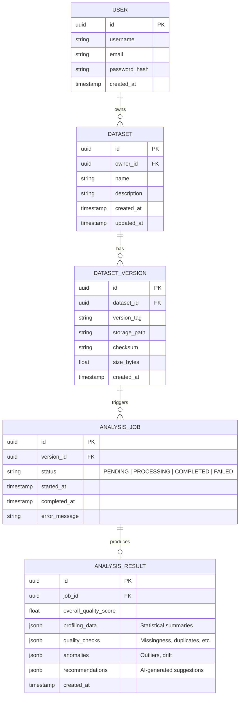

# DataLens Database Specification

## 1. Data Model Overview
DataLens uses PostgreSQL for persistent storage of application metadata, dataset registration, job tracking, and finalized analysis results.

## 2. Entity Relationship Diagram (ERD)

## 3. Table Details

### 3.1 Users
- **Purpose**: Manage authentication and ownership.
- **Indexes**: `email` (Unique).

### 3.2 Datasets
- **Purpose**: Logical grouping of data files.
- **Indexes**: `owner_id`.

### 3.3 Dataset Versions
- **Purpose**: Track individual file uploads.
- **Indexes**: `dataset_id`.

### 3.4 Analysis Jobs
- **Purpose**: Track the lifecycle of a data quality scan.
- **Indexes**: `version_id`.

### 3.5 Analysis Results
- **Purpose**: Store the final output of the Python engine.
- **Indexes**: `job_id` (Unique).

## 4. Redis Responsibilities
Redis is used as a high-performance temporary store, not as a primary database.

- **Job Status Cache**: Maps `job_id` $\rightarrow$ `status` (e.g., `job:123:status` $\rightarrow$ `PROCESSING`). This allows the frontend to poll for status without hitting PostgreSQL on every request.
- **Rate Limiting**: Track request counts per user to prevent API abuse during file uploads.
- **Temporary State**: Store intermediate processing flags for the Python engine if required for multi-stage analysis.

## 5. Storage Strategy
- **Filesystem**: The actual dataset files (CSV/Parquet) are stored on a shared volume (accessible by both Node.js and Python).
- **Paths**: PostgreSQL stores the relative path to the file in `dataset_versions.storage_path`.
